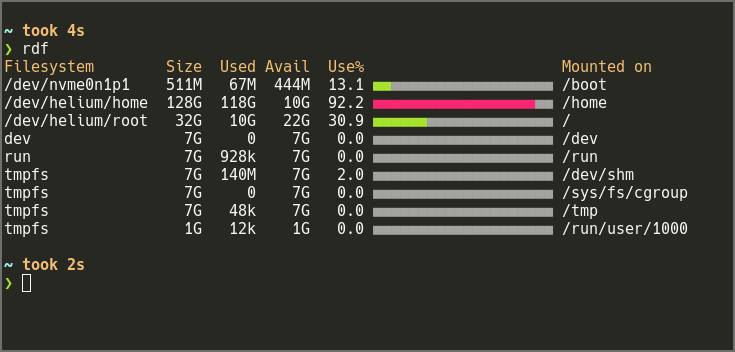

# rust-df

My standard "Hello, World!" program is df.

This is the start of one in Rust.

Here is a video from Rust Belt 2016 which mentions the nix crate I'm using.

[Unix systems programming in rust](https://www.youtube.com/watch?v=Fe6_LFGiqP0)

## Building

Run `cargo build` to build. Alternatively a fabric file is included that wraps
release, debug and static builds. Run `fab --list` to view available targets.

## Screenshot

